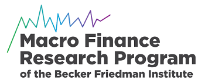

# TwoCapital_Final

[![Contributors][contributors-shield]][contributors-url]
[![Forks][forks-shield]][forks-url]
[![Stargazers][stars-shield]][stars-url]
[![Issues][issues-shield]][issues-url]
[![MIT License][license-shield]][license-url]
[![LinkedIn][linkedin-shield]][linkedin-url]

<!-- PROJECT LOGO -->
 

  

  <h3 align="center">Uncertainty, Social Valuation, and Climate Change Policy</h3>

  

    A thorough introduction to replication package
     
    <a href="https://github.com/binchengecon/TwoCapital_Final.git"><strong>Explore the docs »</strong></a>
     
     
    <a href="https://climatesocialpolicy.readthedocs.io/en/latest/">View Project Presentation Website</a>
    ·
    <a href="https://github.com/binchengecon/TwoCapital_Final/issues/new?labels=bug&template=bug-report---.md">Report Bug</a>
    ·
    <a href="https://github.com/binchengecon/TwoCapital_Final/issues/new?labels=enhancement&template=feature-request---.md">Request Feature</a>
  

